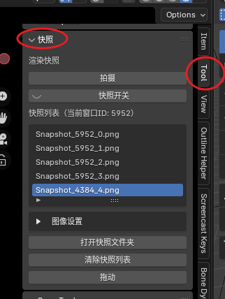
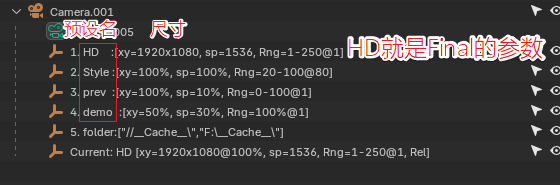

# Snapshot_3d_viewer
> 本脚本由Github Copilot开发，个人引导设计。

【暂不支持 **Blender4.5 Vulkan**后端】

## 主要功能
（原本只打算制作一个IPR对比工具，后面也把常用的功能集成进去了）

1. IPR渲染快照
2. 文件界面快速访问
3. 渲染预设管理
4. 贴图索引
5. 其他搭建、灯光工具
6. pmatte快速绑定

## 安装

github项目右上角 Code - Download ZIP下载，按照常规方式安装即可。

# 1. IPR渲染快照

## 需求与解决
1. 需要一个能对比在做出某些调整之后，可以对比前后差别的工具，类似OctaneRender的IPR`store buffer`
2. 需要保存多个结果，可以前后比较。每个窗口可以独立保存一组结果。

实现：使用blender自带的截图功能，再使用openGL绘制到对应窗口

## 使用

插件位置：3D Viewer 右侧边拉 Tool（快捷键：`n`）

1. 按 ` Ctrl+Alt+右键 ` 拍摄。当前激活区域的3D Viewer内容（保存为临时图片）
2. 按住 `Alt+右键 ` 触发对比查看。

3. 在侧边栏可以显示不同拍摄结果

4. 支持多屏幕通过选择图片切换检查

## 注意事项
1. 不支持Aces色彩空间
2. Eevee下效果较差，未完全采样的情况下拍摄，容易拍到完全低采样的图。降低viewport采样，等到窗口完全采样完成再进行拍摄。
3. 随着运行时间增长，可能会报错，重启即可
4. 暂不支持 **Blender4.5 Vulkan**后端
5. 不支持跟随窗口缩放

# 2. 小工具箱

## 使用

1. 在`Edit - Performance - Add-ons`选择该插件，下面有【启用小工具箱】
2. 插件位置：3D Viewer 右侧边拉 Tool（快捷键：`n`）

## 2.1 父子级操作
1. 【所选物体 到父级】：类似于C4D的`alt+g`的打组功能，用于整理和控制移动

2. 【所选物体 单独每个到父级】：上个功能的单体版，适合用于创建保护动画，比如摇晃和移动进行分离。

3. 【选择所有父级】：blender默认的`shift+g`只能选择一个物体的父级。适合需要选择多个物体移动但不想一个个找父级的情况

4. 【释放到上级】：把选中对象的自己全部释放到上级

5. 【拎出】：多级中间，需要单独拎出一个对象。不再需要进行多次重新链接

6. 【拎出并删除】：把拎出的对象删掉

## 2.2 搭建类操作

1. 【C-P摄像机组】围绕选中物体创建一个Central-Protection摄像机组（摄像机P+R锁定），可以通过移动Protection，制作简单围绕圆心的动画

2. 【C-SP-ZT朝向摄像机组】在C-P摄像机组的基础上，补齐了Stare注视层、Zup对象、DOFTarget对焦对象，添加了世界空间、摄像机空间和朝向单独控制的三层对象功能

3. 【中心约束灯光】对选中物体设置一个中心约束的灯光

4. 【打开当前工程文件夹】就字面意思

5. 【选择组】当有不同的父子级控制对象时候，如果需要选择其中一部分内容，选择组提供了一个新的选择途径

上图中，五组路面分别位于不同的父对象中，如果需要移动最右侧的内容，每次都需要点选一次。

上图中，将需要移动的内容，保存为【选择组】。再进行其他操作之后，通过读取【选择组】，可以还原之前选择的状态

6. 【子对象封包/解包】选择父级对象时很容易选到子对象。使用这个功能可以把子级对象取消可选性

如图，封包后，只有父级的空对象能被选中，方便操作

## 2.3 灯光类

针对导入资产后各种乱七八糟贴图，不知道引用和被使用情况
需要一个工具来整理哪些贴图被哪些材质球使用

第一步是建立索引

选中贴图之后，点击查找，即可知道被哪些材质引用。

可以选中这些全部对象（Edit模式下不行，如果不在当前场景也无法被选择）

## 2.4 动画类

Wiggle动画，类似于AE的Wiggle动画，支持PSR三个属性，通过添加噪波修改器完成。
（重复使用会cover掉）

适合制作飘动动画、飘花、模拟风力等各种情况

## 2.5 渲染预设

点击创建预设，会以一个Final配置，创建4个不同的渲染预设

需要填入xy、采样、帧范围、帧步长，绝对路径和相对路径（用于一键切换）

# 3. 快速文件夹访问（Windows特供版）

1. 需求：**当打开Blender的`文件窗口`，需要到外边复制文件夹路径，再粘贴回文件窗口的路径，才能访问**
2. 解决：**自动读取当前所有已打开的文件夹窗口，在`文件窗口`一键访问**

---
1. 在`Edit - Performance - Add-ons`选择该插件`Snapshot & SomeTools`，下面有【启用快速文件夹访问】
2. 在文件面板，按`Ctrl+G`即可快速轮替访问当前打开着的文件夹窗口。
3. 自动读取会占用一些时间，可以手动刷新最新的文件夹状态。

# 4. pmatte快速绑定
1. 合成器面板，在选中物体后，可以把psr快速绑定到合成面板

（pmatte节点在`/example/pmatte example.blend`，可以直接导入Node Tree）